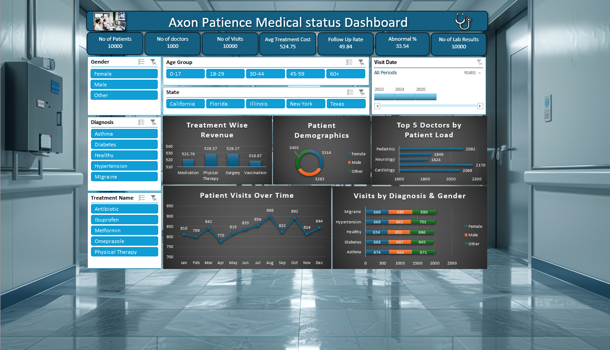
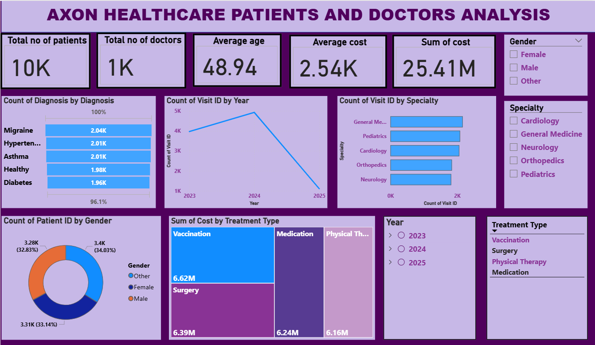
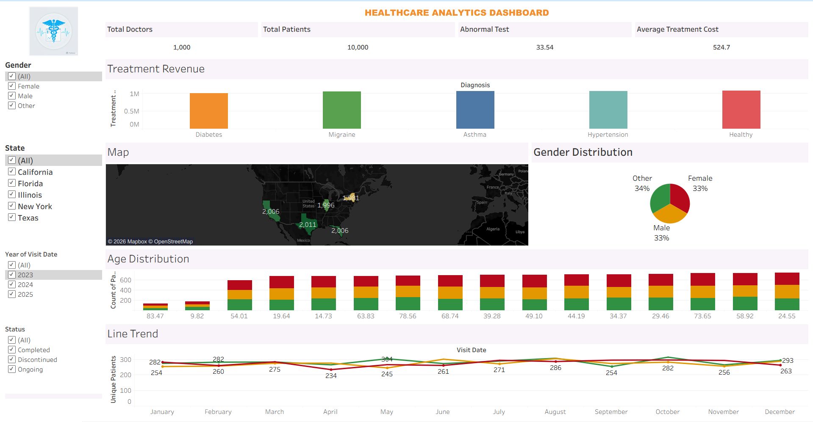

# Axon-Healthcare-analytics (Excel | Power BI | Tableau)

## Project Overview
This project showcases an end-to-end healthcare analytics solution built using Excel, Power BI, and Tableau.  
The objective is to transform raw healthcare data into interactive dashboards that support operational and business decision-making.

---

## Problem Statement
Healthcare data was maintained in static Excel reports across multiple sources, leading to:
- Manual and repetitive reporting
- Limited insights
- No interactivity for stakeholders

There was a need for a centralized, interactive reporting system.

---

## Solution
- Cleaned and validated healthcare datasets
- Designed meaningful KPIs aligned with healthcare operations
- Built dashboards using multiple BI tools to compare analytical and visualization capabilities

---

## Dashboards

### Excel Dashboard
- Pivot tables and pivot charts
- KPI summary cards
- Conditional formatting for trend analysis

**Screenshot:**

📁 `Excel_Dashboard/`

---

### Power BI Dashboard
- Data modeling with relationships
- DAX-based KPI calculations
- Interactive slicers and drill-downs

**Screenshot:**

📁 `PowerBI_Dashboard/`

---

### Tableau Dashboard
- Interactive visual analytics
- Filters and parameters for exploration
- Executive-level dashboard layout

**Screenshot:**

📁 `Tableau_Dashboard/`

---

## Key KPIs
- Total patient visits
- Follow-up rate
- Doctor workload distribution
- Patient demographics
- Visit trends over time

---

## Tools & Technologies
- **Excel** – Pivot Tables, Charts, Conditional Formatting  
- **Power BI** – Data Modeling, DAX, Interactive Reports  
- **Tableau** – Visual Analytics, Dashboards  

---

## How to Run
1. Clone the repository  
2. Open the dashboard file using the respective tool  
3. Use filters and slicers to explore insights  

---

## Key Takeaways
- Replaced static Excel reporting with interactive dashboards
- Delivered actionable healthcare insights
- Demonstrated BI tool versatility and analytics thinking

---

## Author
**Sai Pranav Banaganapalli**  
B.Tech – Computer Science & Engineering  
Data Analytics | Power BI | Tableau | SQL
